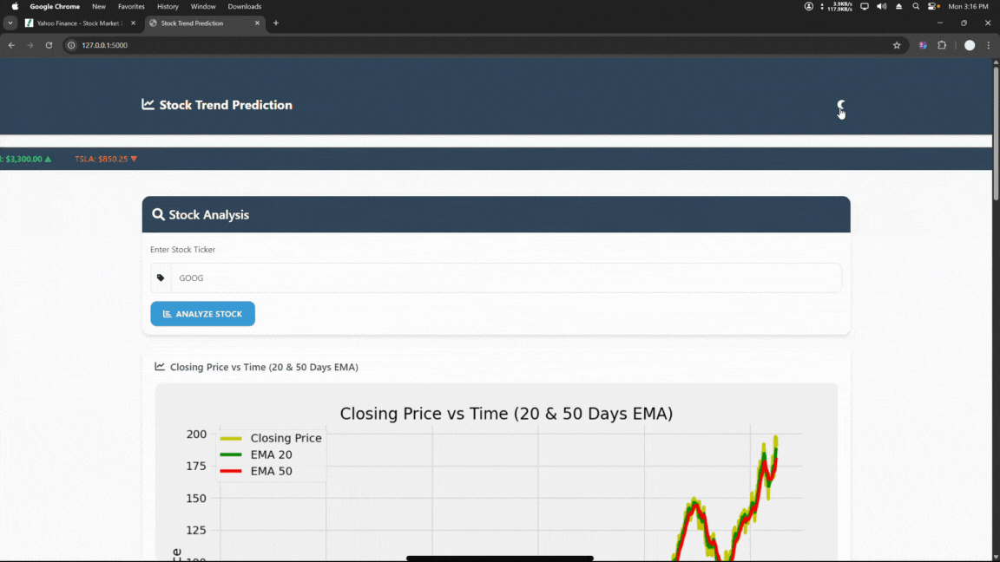

# Project 8: Stock Price Prediction

This project uses an LSTM deep learning model to predict stock closing-price trends from historical market data. It includes a Flask web app that downloads stock data, generates moving-average charts, compares predicted versus actual prices, and allows users to download the fetched dataset.



## Features

- Flask web interface for entering a stock ticker.
- Historical stock download through `yfinance`.
- Pre-trained Keras model loaded from `stock_dl_model.h5`.
- Exponential moving average charts for 20/50 and 100/200 day windows.
- Prediction-versus-original trend chart.
- Dataset export to CSV and download route.

## Project Structure

```text
Project_8_Stock_Price_Prediction/
+-- README.md
+-- OutPut.gif
+-- Dataset/Data.md
+-- Models/
|   +-- Stock_Price_Prediction.ipynb
|   +-- stock_dl_model.h5
+-- Website/
    +-- app.py
    +-- requirements.txt
    +-- Google_stock_data.csv
    +-- stock_dl_model.h5
    +-- templates/index.html
    +-- static/
        +-- AAPL_dataset.csv
        +-- GOOG_dataset.csv
        +-- META_dataset.csv
        +-- NVDA_dataset.csv
        +-- ema_20_50.png
        +-- ema_100_200.png
        +-- stock_prediction.png
```

## Tech Stack

- Python
- Flask
- TensorFlow/Keras
- Pandas and NumPy
- Matplotlib
- Scikit-learn
- yfinance

## Setup

```bash
cd Project/Project_8_Stock_Price_Prediction/Website
python -m venv venv
venv\Scripts\activate
pip install -r requirements.txt
```

## Run Locally

```bash
python app.py
```

Open:

```text
http://127.0.0.1:5000/
```

## How It Works

1. The user enters a stock ticker.
2. The app downloads historical data from 2000-01-01 to 2025-01-01.
3. Closing prices are scaled with `MinMaxScaler`.
4. The LSTM model predicts prices from 100-day windows.
5. The app saves charts in `Website/static/` and renders them in the browser.

## Notes

- Internet access is required when downloading fresh stock data with `yfinance`.
- The app expects `Website/stock_dl_model.h5` to exist.
- Predictions are educational and should not be treated as financial advice.
